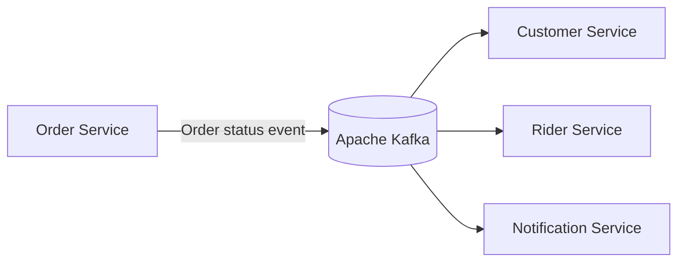
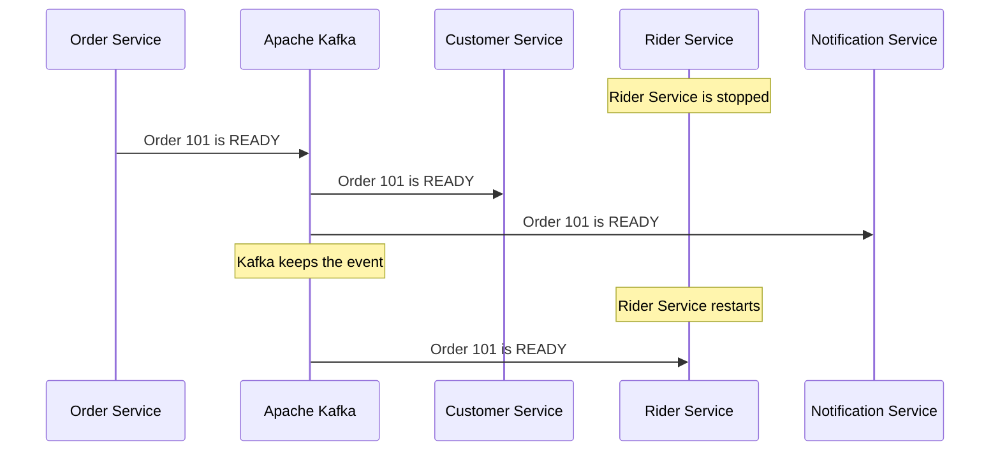

# Project Diagrams

## Architecture

```mermaid
flowchart LR
    A[Order Service] -->|Order status event| B[(Apache Kafka)]
    B --> C[Customer Service]
    B --> D[Rider Service]
    B --> E[Notification Service]
```

The Order Service publishes one event when an order status changes. Each consumer reads the same event independently.

## Rider Restart Demo

```mermaid
sequenceDiagram
    participant O as Order Service
    participant K as Apache Kafka
    participant C as Customer Service
    participant R as Rider Service
    participant N as Notification Service

    Note over R: Rider Service is stopped
    O->>K: Order 101 is READY
    K->>C: Order 101 is READY
    K->>N: Order 101 is READY
    Note over K: Kafka keeps the event
    Note over R: Rider Service restarts
    K->>R: Order 101 is READY
```
